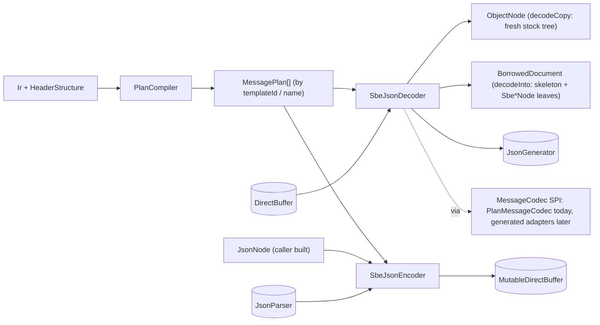

# sbe-jackson — SBE ⇄ Jackson `JsonNode` codec

Revision 2 (2026-09-16). Supersedes revision 1 in full.

## Revision 2 — what changed and why

Revision 1 was a single-model design. Revision 2 is the result of a three-round cross-critique
between two independent reviewers plus one owner decision. The architecture (IR compiled once
into a flat plan, mutable custom nodes in a borrowed skeleton tree, encoder walks the plan not
the JSON) survived. The following revision-1 claims were wrong or under-specified and are replaced:

| Revision 1 | Revision 2 | Reason |
|---|---|---|
| `NodeMode.REUSE / ALLOCATE` flag, both returning a bare `ObjectNode` | Ownership in the type system: `decodeCopy()` returns a stock tree, `decodeInto(BorrowedDocument)` returns a borrowed one | A flag makes borrowed lifetime invisible at call sites |
| Bounds checked against `buffer.capacity()` | Explicit `length`; every read checked against `offset + length` | SBE header carries no total length; a receive buffer holds several messages |
| Group entries: "skip `blockLength − plan.blockLength`" | `cursor = entryBase + actingBlockLength`; each present field checked to fit inside the acting block | Negative skip when acting block is smaller than the plan's |
| Absent-by-version fields emit `null` / nullValue / const | Property omitted; skeleton per effective layout | Collapses "not in this version" with "optional sentinel"; nonsense for required fields |
| Newer `actingVersion` clamped to schema version | Rejected (`NewerVersions.REJECT`); a `PROJECT_ROOT` projection that reports partial consumption is phase 2 | Block length locates the fixed block only; unknown groups / var-data make later sections unlocatable |
| Skeleton keyed by observed `(templateId, actingVersion)` | Keyed by effective-layout index (distinct `sinceVersion` thresholds); bounded by `Limits.maxRetainedBytes` | Observed version numbers are unbounded |
| Bit set → object of named booleans | Numeric mask by default; `BitSetStyle.OBJECT` documented lossy | Named-only loses unnamed bits; object-with-fallback made one field bimodal |
| Group pools capped by length-type max (255 / 65535) | `Limits`: total group entries, var-data bytes, depth, retained bytes | Nested groups multiply; 65535 × 65535 is not a bound |
| `REUSE_CHECKED`: generation stamps on leaves | `newCheckedDecoder()`: fresh skeleton per decode, previous tree poisoned; coverage list documented | Old and new references are the same object; a stamp cannot tell them apart |
| `Sbe*Node.equals` accepts stock counterpart | Symmetric within own class only; `SbeJsonNodes.semanticEquals` for cross-family | `TextNode.equals(SbeStringNode)` is false; asymmetric `equals` breaks `ObjectNode.equals` |
| "Streaming serialize is zero-alloc" | Integer / string / binary writes zero-alloc on `UTF8JsonGenerator`; `writeNumber(double/float)` allocates until a custom formatter | `NumberOutput.toString` path in jackson-core 2.16–2.21 |
| Constants ignored on encode | Supplied constants always validated; omitted is fine | Silently accepting a contradictory value |
| `strictEncoding(boolean)` | `UnknownProperties.ERROR` (default) / `IGNORE` | One flag hid two unrelated policies |
| Encoder stateless and shared | Thread-confined encoder bound to a template (`newEncoder(templateId)`) | Leaves room for scratch state and generated backends without changing the contract |
| No streaming path (non-goal) | `writeJson(JsonGenerator)` ships; `encode(JsonParser)` ships with schema-order rule for variable sections | Both reuse the plan unchanged; the parser path needs no replay buffer under that rule |
| Codegen "rejected" | Deferred behind a `MessageCodec` SPI; built only when benchmarks justify | Interpreter is needed anyway for runtime schemas and as the oracle |
| "1.5–3× slower reads than flyweights", "switch beats itable" | Withdrawn as numbers; hypotheses for JMH | Never measured |

## 1. Goal

Convert SBE messages (any schema, loaded at runtime from IR) to and from Jackson 2.x `JsonNode` trees
with the smallest possible steady-state allocation and the highest throughput a generic
(non-generated) implementation can reach. Provide a direct `JsonGenerator` sink for consumers who
want bytes rather than a tree.

### Allocation honesty statement

A tree of stock Jackson nodes allocates at least one object per value; that path
(`decodeCopy`) is offered and is never zero-allocation. Zero steady-state allocation is reached only
through a **borrowed document**: a per-decoder skeleton tree whose leaves are custom mutable
`NumericNode` / `ValueNode` subclasses overwritten in place, valid until the next decode into the
same document.

The allocation claim is scoped, never library-wide:

> 0 B/op measured for a successful `decodeInto` on an adequately provisioned `BorrowedDocument`,
> for this template and corpus, using the supported access pattern (`longValue`, `doubleValue`,
> `booleanValue`, `get`, `path`, `size`), after warm-up, with retained bytes reported alongside.
> `writeJson` on `UTF8JsonGenerator` is 0 B/op for integer, string and binary content.
> `encode` from a tree is 0 B/op except through `binaryValue()`.

Operations that allocate by construction:

- `textValue()` on a string leaf (one `String`, cached until the leaf is next written), `asText()` on numbers.
- `numberValue()` (boxes outside the `Long` cache), `bigIntegerValue()`, `decimalValue()`.
- `binaryValue()` (returns an exact-size copy — `BinaryNode` contract). Zero-alloc access is
  `SbeBinaryNode.byteArray()` + `length()`.
- Iterators: `fields()`, `fieldNames()`, `elements()`.
- `snapshot()` / `deepCopy()`, `ObjectMapper.writeValueAsBytes` result array, `toString()`.
- `writeNumber(double)` / `writeNumber(float)` on any stock generator (formats through a `String`).
  A buffer-based Schubfach/Ryu formatter into `char[24]` + `writeNumber(char[],int,int)` is phase 2.
- `writeNumber(BigInteger)`; uint64 above `Long.MAX_VALUE` in `decodeCopy` trees (`BigIntegerNode`).
- Warm-up: pools and scratch arrays grow to their high-water mark within `Limits`.
- `decodeCopy` entirely; the caller's `readTree` on the encode side; one exception object per error.

Compatibility hazard (not an allocation): downstream code doing `instanceof TextNode` /
`LongNode` on a borrowed tree fails. Use `decodeCopy` or `snapshot()` for such consumers.

## 2. Non-goals

- No changes to the SBE code generator or to `sbe-all`.
- No generated Jackson adapters in the first release. The `MessageCodec` SPI exists so they can be added
  later if benchmarks justify them (§15).
- No arbitrary-order variable sections on the `JsonParser` → SBE path. Groups and var-data must arrive in
  schema order; otherwise use the tree path.
- No schema-agnostic "guess the type" mode. Everything is driven by IR.
- No timestamp / `semanticType` formatting, no decimal-composite → `double` conversion. Numbers stay numbers.
- No byte-identical round-trip guarantee. Padding, NaN payloads and unknown extension bytes are not preserved;
  the promise is semantic equality.

## 3. Assumptions (decided, not blocking)

| Topic | Decision |
|---|---|
| Placement | New Gradle module `sbe-jackson` in this repo (`settings.gradle`). Depends only on public `sbe-tool` API (`uk.co.real_logic.sbe.ir.*`, `uk.co.real_logic.sbe.otf.*`) so the same code can move to a standalone repo. |
| Java | 17, matching `sourceCompatibility` in `build.gradle`. |
| Jackson | 2.x. Compile against 2.16.1 (lowest in local cache with all APIs used), run the test suite against 2.21.4 too. See §11 for Jackson 3. |
| Agrona | 2.6.0 already provided via `sbe-tool` `api` dependency. |
| Runtime strategy | IR compiled once into a flat plan; no per-message `List<Token>` walking (§5). |
| Dispatch | Single `FieldPlan` class with a `byte kind`, `switch` in the decode/encode loops (mirrors `OtfMessageDecoder`). A struct-of-arrays variant (`byte[] kind`, `int[] offset`, …) is built as a JMH alternative; whichever measures faster ships. |
| Frame | Decode takes `(buffer, offset, length)`. Every read is bounded by `offset + length`, never by `buffer.capacity()`. |
| Header | Not part of the body tree. `OtfHeaderDecoder` is reused for reading; `templateId`, `actingVersion`, `blockLength` are exposed on `BorrowedDocument` (borrowed path) and on `SbeJsonDecoder.lastHeader()` — a thread-confined `HeaderView` overwritten by every decode, and the only way to read the header after `decodeCopy` or `writeJson`. Encode writes the header from IR: the supplied IR's `blockLength` and `version`. |
| Version targeting | One `SbeJson` encodes exactly its IR's version. Encoding an older layout means building a second `SbeJson` from that version's IR; there is no header-version override. |
| Thread-safety | Compiled plans (`SbeJson`) shared and immutable. `SbeJsonDecoder` and `SbeJsonEncoder` are thread-confined, non-reentrant instances. The interpreter encoder happens to be stateless internally; the contract does not promise it. |
| Error model | One unchecked `SbeJsonException`. `IOException` only from methods that write to a caller-supplied `JsonGenerator`. |

## 4. Architecture



Public API:

```java
final Ir ir = new IrDecoder("car.sbeir").decode();   // or XmlSchemaParser + IrGenerator

final SbeJson sbeJson = SbeJson.builder(ir)
    .enumStyle(EnumStyle.NAME)                       // unknown raw value -> number
    .bitSetStyle(BitSetStyle.MASK)                   // OBJECT is a presentation policy, lossy for unnamed bits
    .charArrayStyle(CharArrayStyle.NUL_TERMINATED)   // EXACT keeps all N chars including NULs
    .unknownProperties(UnknownProperties.ERROR)      // default; IGNORE opt-in
    .newerVersions(NewerVersions.REJECT)             // only option in release 1; PROJECT_ROOT is phase 2 (§13)
    .exceptionStackTraces(true)                      // false for hostile-input gateways
    .limits(Limits.builder()
        .maxGroupEntries(10_000)                     // total across all groups and nesting
        .maxVarDataBytes(1 << 20)
        .maxDepth(8)
        .maxRetainedBytes(16 << 20).build())
    .build();                                        // compiles plans once; immutable; shared

// one per thread
final SbeJsonDecoder decoder = sbeJson.newDecoder();

// fresh stock tree, retainable, allocates
final ObjectNode tree = decoder.decodeCopy(buffer, offset, length);
final HeaderView header = decoder.lastHeader();      // templateId, actingVersion, blockLength; overwritten by the next decode

// borrowed, zero-allocation steady state
final BorrowedDocument doc = decoder.newDocument();
final int consumed = decoder.decodeInto(buffer, offset, length, doc);
doc.root();            // JsonNode, valid until the next decodeInto(doc)
doc.snapshot();        // independent stock tree (allocates)
doc.templateId(); doc.actingVersion(); doc.blockLength(); doc.valid();

// no tree
decoder.writeJson(buffer, offset, length, jsonGenerator);

// one per thread, bound to a template and the IR's version
final SbeJsonEncoder encoder = sbeJson.newEncoder("Car");            // or newEncoder(templateId)
final int written = encoder.encode(body, dst, dstOffset, dstAvailable);   // header + body, single pass
final int needed  = encoder.encodedLength(body);                          // optional sizing pass
encoder.encode(jsonParser, dst, dstOffset, dstAvailable);                 // schema-order variable sections

// debug: allocates per decode, poisons the previous tree
final SbeJsonDecoder checked = sbeJson.newCheckedDecoder();
```

Backend scope: `MessageCodec` covers `decodeInto` and `encode(JsonNode)`. `decodeCopy` is implemented as
`decodeInto` on a decoder-private `BorrowedDocument` followed by `snapshot()`, so it rides on the same backend.
`writeJson` and `encode(JsonParser)` are interpreter-only in release 1; a phase-2 generated adapter that wants
them extends the SPI then.

Classes (all in `uk.co.real_logic.sbe.jackson`):

| Class | Role |
|---|---|
| `SbeJson` | Builder + facade. `Int2ObjectHashMap<MessagePlan>` by templateId, `Map<String,MessagePlan>` by name, `OtfHeaderDecoder`, header layout for encoding, policies, `Limits`. |
| `EnumStyle`, `BitSetStyle`, `CharArrayStyle`, `UnknownProperties`, `NewerVersions` | Policy enums. |
| `Limits` | Total group entries, var-data bytes, nesting depth, retained bytes per document. |
| `PlanCompiler` | `Ir` → `MessagePlan`. Mirrors the token walk of `OtfMessageDecoder` (fields, then groups, then var-data) but records instead of dispatching. No Jackson import. |
| `MessagePlan` | `templateId`, `name`, `blockLength`, `schemaVersion`, flat `FieldPlan[]`, root child range, sorted distinct `sinceVersion` thresholds (effective-layout table). No Jackson import. |
| `FieldPlan` | One flat record per field / composite member / group / var-data: `kind`, `name` (interned), `offset` (scope-relative), `primitiveType`, `byteOrder`, `arrayLength`, `encodedLength`, `sinceVersion`, `presence`, `nullValueLong`, `nullValueDouble`, `minValue`, `maxValue`, const value, `childStart`, `childEnd`, `enumValues` (sorted `long[]`) + `enumNames`, `choiceNames` + `choiceBits` + `knownMask`, `Object2IntHashMap<String>` name lookup, `characterEncoding` tag, group dimension layout (`blockLengthType/offset`, `numInGroupType/offset`, `dimensionSize`), var-data length type / offset. No Jackson import. |
| `MessageCodec` | SPI: `int decodeInto(DirectBuffer, int, int, BorrowedDocument)`, `int encode(JsonNode, MutableDirectBuffer, int, int)`. One per template. |
| `PlanMessageCodec` | The interpreter. `switch (kind)` loops over `FieldPlan[]`. Only production backend in release 1. |
| `SbeJsonDecoder` | Thread-confined. `decodeCopy`, `decodeInto`, `writeJson`, `newDocument`, `lastHeader`. Routes by header templateId. |
| `HeaderView` | Thread-confined per decoder; `templateId`, `schemaId`, `actingVersion`, `blockLength` of the last decode on that decoder. Overwritten by every decode. |
| `SbeJsonEncoder` | Thread-confined, bound to one template. `encode(JsonNode…)`, `encode(JsonParser…)`, `encodedLength`. |
| `BorrowedDocument` | Per decoder: skeleton registry keyed by `(templateId, layoutIndex)`, leaf references by `FieldPlan` index, per-group `ArrayNode` + pooled entry skeletons (recursive), scratch `char[]` / `byte[]`, `valid`, header ints, `retainedBytes`. |
| `JacksonCaches` | Per `SbeJson`: prebuilt immutable constant nodes, enum name `TextNode`s, `SerializedString` field names. The only place plan metadata meets Jackson objects. |
| `SbeLongNode` | `NumericNode` subclass, mutable `long`, `NumberType` tag INT/LONG, `unsigned64` flag. |
| `SbeDoubleNode` | `NumericNode` subclass, mutable `double`, tag FLOAT/DOUBLE. |
| `SbeStringNode` | `ValueNode` subclass, `char[]` + length, lazily cached `String`. |
| `SbeBinaryNode` | `ValueNode` subclass, `byte[]` + length, node type BINARY. |
| `SbeJsonNodes` | `semanticEquals(JsonNode, JsonNode)` — nodeType + value walk across custom and stock families. |
| `Utf8` | Hand-rolled UTF-8 decode (buffer → `char[]`, U+FFFD on invalid wire bytes), encode (`CharSequence` → buffer; an unpaired surrogate is reported by `encodedLength`, never replaced), validity scan, surrogate aware. |
| `SbeJsonException` | Unchecked; all validation failures. Error code, templateId, byte offset, copied path indices; message formatted at throw. |
| `ErrorCode` | Enum: `UNKNOWN_TEMPLATE`, `UNSUPPORTED_VERSION`, `FRAME_OVERFLOW`, `FIELD_OUTSIDE_BLOCK`, `LIMIT_EXCEEDED`, `MISSING_REQUIRED`, `TYPE_MISMATCH`, `OUT_OF_RANGE`, `UNKNOWN_ENUM`, `UNKNOWN_CHOICE`, `UNKNOWN_PROPERTY`, `CONSTANT_MISMATCH`, `SECTION_OUT_OF_ORDER`, `DESTINATION_OVERFLOW`. |

## 5. Plan compilation (once per `SbeJson`)

`PlanCompiler` walks the IR tokens for each message exactly as `OtfMessageDecoder` would and emits one
`FieldPlan` per leaf or container, in decode order (block fields, then groups, then var-data, recursively).

- Offsets are **scope-relative**: relative to the message block start for root fields, relative to the entry
  start for group fields. Composite members carry the composite's offset added in, so one read per leaf.
- `encodedLength` is stored per leaf so the decoder can check `offset + encodedLength <= actingBlockLength`.
- Enum tables: `long[] enumValues` sorted for binary search, parallel `String[] enumNames`; reverse
  `Object2IntHashMap<String>` for encoding. Bit sets: `choiceBits`, `choiceNames`, `knownMask`.
- Group dimension layout, var-data length type and offset, `characterEncoding` tag, presence, null / min /
  max values, constant value, `sinceVersion`, `deprecated` are all captured; nothing is re-derived per message.
- Effective-layout table per message: sorted distinct `sinceVersion` values across the whole message.
  `actingVersion` → layout index by binary search. Bound is `thresholds + 1` per template regardless of which
  version numbers appear on the wire.
- Field names are interned once (`String.intern()`) so `ObjectNode.get(name)` hits a cached hash.
- Jackson-specific caches (`JacksonCaches`) are built alongside but live in a separate object so the plan
  classes stay free of Jackson imports (§11).

## 6. Decode algorithm

Common prologue for all three entry points:

```
frameEnd = offset + length                                 // checked: >= offset, <= capacity
header   = OtfHeaderDecoder at offset (checked to fit)
plan     = plans[templateId]                               // unknown -> UNKNOWN_TEMPLATE
if actingVersion > plan.schemaVersion: UNSUPPORTED_VERSION   // release 1; PROJECT_ROOT projection is phase 2 (§13)
layout   = plan.layoutIndex(actingVersion)
```

Entry walk (root and every group entry share it):

```
decodeEntry(plan, entryFields, buf, entryBase, actingBlockLength, actingVersion, frameEnd, target):
    checked(entryBase + actingBlockLength <= frameEnd)
    for f in entryFields:
        if f.sinceVersion > actingVersion: continue          // property omitted; not in this layout's skeleton
        if f.isConstant: emit constant (no bytes read); continue
        checked(f.offset + f.encodedLength <= actingBlockLength)   // FIELD_OUTSIDE_BLOCK
        read at entryBase + f.offset ...
    cursor = entryBase + actingBlockLength
    for g in groups:
        if g.sinceVersion > actingVersion: continue          // omitted; consumes no bytes
        read dims at cursor (checked); numInGroup validated against g.numInGroupType min..max from IR
        count against Limits.maxGroupEntries (running total for the document), maxDepth
        cursor += dimensionSize
        array.removeAll()                                    // ArrayList.clear(), no allocation
        for i in 0..numInGroup:
            entry = pool.entryAt(i)                          // grow to high-water within Limits
            cursor = decodeEntry(g, entry fields, buf, cursor, dimBlockLength, actingVersion, frameEnd, entry)
            array.add(entry)
    for v in varData:
        if v.sinceVersion > actingVersion: continue
        read length at cursor (checked); against Limits.maxVarDataBytes
        copy bytes into leaf scratch; cursor += lengthSize + len
    return cursor
```

Per-construct behaviour in the borrowed path:

| Construct | Decode |
|---|---|
| int8/16/32, uint8/16/32, int64 | `SbeLongNode.set(Types.getLong(...))`. Optional and equal to nullValue → `NullNode`. `numberType()` INT for ≤32-bit signed and uint8/16, LONG for int64/uint32. |
| uint64 | `setUnsigned(raw)`; `numberType()` LONG when `raw >= 0`, BIG_INTEGER otherwise; `serialize()` writes unsigned digits via `char[20]` + `writeNumber(char[],int,int)`. |
| float/double | `SbeDoubleNode.set`. Optional null test is `Double.isNaN(v)` when the sentinel is NaN, value compare otherwise. |
| `char` | one-char string. |
| `char[N]` | `NUL_TERMINATED`: copy up to first NUL or N. `EXACT`: all N chars. |
| numeric `[N]` | skeleton `ArrayNode` of N leaves set in place; never cleared. |
| enum | binary search → prebuilt immutable `TextNode` (shared). Unknown raw → number leaf. `ORDINAL` style → number always. |
| bit set | `MASK`: `SbeLongNode` with the raw value. `OBJECT`: skeleton `ObjectNode` of named booleans (`BooleanNode` singletons), documented lossy for bits outside `knownMask`. |
| composite | recurse into child skeleton `ObjectNode`. |
| constant | prebuilt stock node from `JacksonCaches`; consumes no bytes. |
| group | as above. Empty → `[]`. |
| var-data text | `Utf8.decode` (or ASCII copy) into `SbeStringNode` scratch `char[]`. |
| var-data binary (`characterEncoding` null / `binary`) | copy into `SbeBinaryNode` scratch `byte[]`; serializes base64. |
| `sinceVersion > actingVersion` | property absent from this layout's skeleton. |
| `deprecated` | decoded normally. |

Presence toggling: required leaves are fixed in the skeleton and never replaced. Optional leaves keep a
per-slot `boolean present`; `ObjectNode.replace(name, leaf | NullNode)` runs only on a transition, so the
steady per-field cost is one buffer read and one field store. `replace` on an existing key is a
`LinkedHashMap.put` on an existing entry: no allocation, insertion order preserved.

Skeleton registry: keyed `(templateId, layoutIndex)`, built lazily, retained bytes counted against
`Limits.maxRetainedBytes`. Exceeding the budget is a `SbeJsonException`, not a silent eviction.

Failure leaves `doc.valid() == false` until the next successful `decodeInto(doc)`. `valid()` describes the
document, not whether some reference the caller extracted earlier belongs to the current decode.

`decodeCopy` runs the same walk with a stock-node `JsonNodeFactory`; uint64 above `Long.MAX_VALUE` becomes
`BigIntegerNode`.

`writeJson` runs the same walk against a `JsonGenerator`: `writeFieldName(SerializedString)`,
`writeNumber(long)`, `writeString(char[],0,n)`, `writeBinary(b64, byte[],0,n)`. Var-data text on an on-heap
buffer with UTF-8 / ASCII encoding is scanned once for validity and then written with
`writeUTF8String(src.byteArray(), src.wrapAdjustment() + payloadOffset, len)`; invalid bytes or other
charsets go through `Utf8.decode` to `char[]` and `writeString`. `writeNumber(double)` allocates on stock
generators until phase 2 (§13). A persistent generator per thread is the measured configuration.

## 7. Encode algorithm (`JsonNode` → SBE)

Walk the **plan**, never the JSON. `obj.get(name)` is a `HashMap.get` with a cached hash; `fields()` and
`fieldNames()` allocate iterators and are never called on the happy path.

```
encode(body, plan, dst, off, available):
    write header (plan.blockLength, templateId, schemaId, schemaVersion)
    pos = off + headerLen
    encodeBlock(plan.rootFields, body, dst, pos)      // fixed offsets: JSON key order irrelevant
    pos += plan.blockLength                            // padding bytes: caller zero-fills if comparing bytes
    pos = encodeTail(plan.rootGroups, plan.rootVarData, body, dst, pos)   // schema order
    // per ObjectNode (root, each composite, each group entry), not root only:
    if unknownProperties == ERROR and recognizedCount(obj) != obj.size(): slow path names the first unknown key
    return pos - off
```

Groups: `ArrayNode.size()` gives the count directly; no counting pre-pass. Validate against the dimension
type's min..max and `Limits`, write the dimension header, then an index loop (`array.get(i)`, no iterator).
Var-data: bytes are written at `pos + lengthSize` straight from `textValue()` via `Utf8.encode` (no
`String.getBytes`), then the length is back-filled.

Coercion policy:

| Field | Accepts | Rejects |
|---|---|---|
| ints | `isIntegralNumber()` and `canConvertToLong()` within schema min..max; uint64 also `BigIntegerNode` or decimal string | floating node (`5.0` → error, no silent truncation), out of range (including an optional scalar's own null sentinel: `cupHolderCount: 255` is `OUT_OF_RANGE`; omit or `null` to select it), negative into unsigned |
| float/double | `isNumber()` within schema min..max; strings `"NaN"`, `"Infinity"`, `"-Infinity"` | other strings, finite value out of range (an optional scalar's finite sentinel included) |
| optional numeric `[N]` | each element as above, **plus** the null sentinel per element (compared at wire precision: a float field compares as `float`) so decoded arrays, which expose sentinels as numbers, re-encode byte-identically; missing / `null` fills every element with the sentinel | element out of range, wrong element count |
| `char[N]` | `textValue()` length ≤ N, `charAt` loop, NUL pad | char > 0x7F into an ASCII field, too long, unpaired surrogate or character unmappable in the field charset (`TYPE_MISMATCH`) |
| enum | name via `Object2IntHashMap<String>`, or integral | unknown name |
| bit set | integral mask, or `ObjectNode` of booleans | unknown choice name |
| composite | `ObjectNode` | other |
| group | `ArrayNode` of `ObjectNode`; missing → dimensions with `numInGroup = 0` | size outside dimension type range or `Limits` |
| var-data text | `textValue()` → `Utf8.encode` into `dst` (other charsets through a bounded `CharsetEncoder`) | length > length type max, unpaired surrogate or unmappable character (`TYPE_MISMATCH`) |
| var-data binary | `binaryValue()` (allocates; inherent) | |
| constant | omitted, or present and equal to the schema constant | present and different |
| missing / `null` | optional → nullValue; group → empty; var-data → length 0 | required → error |

Text policy (fixed `char[N]` and var-data alike, every charset): malformed input is **rejected** with
`TYPE_MISMATCH`, never replaced. An unpaired UTF-16 surrogate in a Java string has no encoding in any charset; the
strict coercion rule above (`5.0` into an int is an error) applies to text too, so no U+FFFD or `?` ever reaches the
wire from the encoder. The decoder still maps invalid UTF-8 *wire bytes* to U+FFFD, because rejecting a received
message for one bad byte in a string is not the decoder's call. The encoder retains nothing owned by the caller
after a call returns or throws: the destination reference is cleared in a `finally`.

Unknown properties: `ERROR` by default. The happy path counts recognized properties during the plan walk and
compares with `size()` **per `ObjectNode`** — root, every composite, every group entry — otherwise unknown keys
inside groups would pass silently; the slow path that names the offending key runs only on mismatch, so the check
is free on valid input. `IGNORE` skips the count.

Single pass: on overflow or validation failure the destination region is invalid and the exception carries the
field path. `encodedLength(body)` is an optional second traversal (counts UTF-8 bytes) for callers who want
capacity certainty first; the input must not change between the two calls. Neither call is transactional.

`encode(JsonParser …)`: block fields in any order (fixed offsets); groups and var-data must arrive in schema
order (`SECTION_OUT_OF_ORDER` otherwise). Unknown counts and lengths are handled by reserving the dimension
or length prefix and back-filling after `]` / the string end. No replay buffer; callers with arbitrary-order
input use the tree path.

## 8. Custom node semantics (the part that silently breaks)

| Method | Rule |
|---|---|
| `deepCopy()` | `ValueNode` default returns `this` — an aliasing bug for mutable nodes. Return the stock equivalent (`LongNode` / `IntNode` / `BigIntegerNode` / `DoubleNode` / `FloatNode` / `TextNode` / `BinaryNode`). |
| `asToken()`, `getNodeType()` | Exactly as stock: `VALUE_NUMBER_INT` / NUMBER, `VALUE_NUMBER_FLOAT` / NUMBER, `VALUE_STRING` / STRING, `VALUE_EMBEDDED_OBJECT` / BINARY. |
| `numberType()`, `isInt` / `isLong` / `isBigInteger` / `isFloat` / `isDouble` | `JsonNode` defaults are `false`; override consistently with the SBE type. |
| `isIntegralNumber` / `isFloatingPointNumber` / `isNaN` | Override; the encoder gates on these when round-tripping borrowed trees. |
| `canConvertToInt` / `canConvertToLong` | Range based; uint64 with the high bit set → `canConvertToLong() == false`. |
| `intValue` / `longValue` / `doubleValue` | Field reads, no allocation. `numberValue()` and friends box on demand. |
| `serialize()` | `writeNumber(long)`, `writeNumber(double)` (allocates on stock generators — phase 2), `writeString(char[],0,len)`, `writeBinary(b64, byte[],0,len)`. uint64 above `Long.MAX_VALUE`: unsigned digits into a per-node `char[20]`, `writeNumber(char[],int,int)` — string-free on `UTF8JsonGenerator` and `WriterBasedJsonGenerator`; the base `JsonGenerator` implementation builds a `String`. |
| `equals` / `hashCode` | Symmetric **within the custom class only**. `TextNode.equals` requires `instanceof TextNode`, so accepting a stock counterpart one-way would break the contract and make `ObjectNode.equals` order dependent. Cross-family comparison is `SbeJsonNodes.semanticEquals(a, b)`; tests compare via `snapshot()`. |
| `textValue()` | `SbeStringNode` builds a `String` once and caches it until the next `set`. |

Borrowed-document contract (Javadoc on `BorrowedDocument`):

- Traversal-only from the application's side. Mutating containers (`put`, `remove`, `add`) invalidates the skeleton.
- Every value simultaneously visible in the tree has its own storage; no leaf is shared between two positions.
- `root()` and anything reached from it are valid until the next `decodeInto(doc)`. Retaining a reference past
  that is a contract violation that release builds do not detect.
- `newCheckedDecoder()` detects it in debug: each decode builds a fresh skeleton and poisons the previous one
  (`stale = true`; every accessor throws `IllegalStateException("borrowed node used after next decode")`).
  Coverage: `Sbe*Node` value accessors and `serialize`, `ObjectNode` `get` / `path` / `has` / `size`, `ArrayNode`
  `get` / `size`. Not covered: iterators or `Map.Entry` objects already obtained before the next decode, and
  shared immutable leaves (`NullNode`, `BooleanNode`, enum name `TextNode`s, constants), which are valid by
  construction.

Jackson 2.x minors add abstract methods to `NumericNode`. Compile against 2.16.1; run the suite against 2.21.4.

## 9. JSON conventions (round-trip table)

| SBE | JSON (decode) | Encode accepts |
|---|---|---|
| signed ints, uint8/16/32 | number | integral node in range |
| uint64 | unsigned decimal number (never through `double`) | integral node, `BigIntegerNode`, decimal string |
| float / double | number; NaN / ±Infinity per Jackson `WRITE_NAN_AS_STRINGS` | number or `"NaN"` / `"Infinity"` / `"-Infinity"` |
| optional field at null sentinel | `null` | `null` or absent |
| required field | value | value (absent → error) |
| absent in acting version | property omitted | ignored if present |
| `char` | 1-char string | 1-char string |
| `char[N]` | string, `NUL_TERMINATED` (default) or `EXACT` | well-formed string ≤ N chars, NUL padded |
| numeric `[N]` | array of N numbers (optional: sentinels exposed as numbers, never `null` elements) | array of N numbers; optional arrays accept the sentinel per element |
| enum | name (`NAME`, default); unknown raw → number; `ORDINAL` → number | name or number |
| bit set | number mask (`MASK`, default); `OBJECT` → `{choice: bool}` (lossy for unnamed bits) | number or object |
| composite | nested object | nested object |
| constant | value from IR (consumes no bytes) | omitted, or equal to the constant |
| group | array of objects; empty → `[]` | array; missing → `numInGroup = 0` |
| var-data text | string in schema charset | well-formed string (unpaired surrogate → `TYPE_MISMATCH`) |
| var-data binary | base64 string (`BinaryNode` semantics) | base64 string |
| header | not in body; `templateId` / `actingVersion` / `blockLength` on `BorrowedDocument` or `decoder.lastHeader()` | derived from IR |

Documented divergences from `JsonPrinter`: uint64 printed unsigned (printer prints signed), bit sets as
mask (printer prints choice names), binary as base64 (printer emits `PrintBufferUtil.hexDump` when `characterEncoding` is null), absent-by-version omitted
(printer emits nullValue / constant), unknown enum as number (printer prints `"null"`), NaN as string.

## 10. Module layout and build changes

```
sbe-jackson/
  DESIGN.md
  src/main/java/uk/co/real_logic/sbe/jackson/{SbeJson, EnumStyle, BitSetStyle, CharArrayStyle,
      UnknownProperties, NewerVersions, Limits, PlanCompiler, MessagePlan, FieldPlan, MessageCodec,
      PlanMessageCodec, SbeJsonDecoder, SbeJsonEncoder, BorrowedDocument, HeaderView, JacksonCaches,
      SbeLongNode, SbeDoubleNode, SbeStringNode, SbeBinaryNode, SbeJsonNodes, Utf8,
      SbeJsonException, ErrorCode, package-info}.java
  src/test/java/uk/co/real_logic/sbe/jackson/...
  src/test/resources/  (reuse sbe-tool test schemas via a resources dependency, plus small edge-case schemas)
```

- `settings.gradle`: `include 'sbe-jackson'`.
- `gradle/libs.versions.toml`: `jackson = "2.16.1"` compile baseline; `jackson-databind` library entry.
- `build.gradle`: new `project(':sbe-jackson')` block: `api project(':sbe-tool')`, `api libs.jackson.databind`,
  test deps `junit`, `hamcrest`, `jqwik`; a `testLatestJackson` task that forces `2.21.4`. Checkstyle and
  the repo's `-Werror` javac flags apply unchanged (final parameters, brace style).
- `sbe-benchmarks`: `implementation project(':sbe-jackson')`; Jackson enters only the benchmark shadow jar.
- Nothing added to `sbe-all`.

## 11. Jackson 3 versus Jackson 2

Short answer: not better for speed, only better if the consumers are already on Jackson 3.

| Aspect | Jackson 2.x (2.21.4) | Jackson 3.x (3.2.2) |
|---|---|---|
| Tree performance | `ObjectNode` over `LinkedHashMap`, same mutable API | Same internals, no measurable difference for this workload |
| Node subclassing surface | `NumericNode`: 10 abstract methods; `TextNode`; `serialize(JsonGenerator, SerializerProvider)`; checked `IOException` | `NumericNode` adds `isNaN()` and `_asString()`; `StringNode` replaces `TextNode`; `serialize(JsonGenerator, SerializationContext)`; unchecked `JacksonException` (cleaner hot path) |
| Generator APIs needed | `writeNumber(char[],int,int)`, `writeString(char[],int,int)`, `writeBinary(Base64Variant,byte[],int,int)`, `writeUTF8String` all present | All present with the same shapes |
| Ecosystem (Sept 2026) | Spring Boot 3 line, most libraries | Spring Boot 4 line, `tools.jackson.*` packages, cannot share one artifact with 2.x |
| API stability for our custom nodes | Mature, slow churn | Younger, abstract sets still moving in minors |

Decision: target Jackson 2 as asked. `PlanCompiler`, `MessagePlan`, `FieldPlan`, `MessageCodec`, `Limits`,
`Utf8` and the buffer read/write helpers carry no Jackson import, so a `sbe-jackson3` adapter module is only
`JacksonCaches`, the node classes, `BorrowedDocument`, decoder and encoder. Do not attempt a single artifact
that supports both; package names differ and the `serialize` signatures conflict.

## 12. Verification plan

Correctness:

- `PlanCompilerTest`: offsets, sizes, dimension layouts, layout tables for `car.xml` and
  `fix-message-samples.xml` equal what `OtfMessageDecoder` visits (record via a `TokenListener` spy).
- `DecodeConformanceTest`: for every sample message, `readTree(JsonPrinter.print(...))` semantically equals
  `decodeCopy(...)` and `decodeInto(...).snapshot()` modulo the divergences listed in §9.
- `EncoderOracleTest`: bytes from `encode` equal bytes from the generated `CarEncoder` for the same tree
  (both buffers zero-filled first; padding is unspecified). This is the oracle for the from-scratch plan
  encoder, since `sbe-tool` has no OTF encoder.
- `RoundTripTest`: generated `Car` encoder bytes → decode → encode → decode; compare via `semanticEquals`.
- `EncodeValidationTest`: every reject row of §7 (missing required, unsigned negative, float into int, char
  overflow, var-data length overflow, unknown enum name, unknown choice, wrong container type, unknown property
  under `ERROR`, contradictory constant, group count over `Limits`, frame overflow).
- `NodeCompatibilityTest`: on a borrowed tree, `writeTree`, `writeValueAsBytes`, `treeToValue(Map.class)`,
  `convertValue`, `toString`, `at("/ptr")`; `snapshot()` independence (next decode does not change the copy);
  `equals` symmetric within custom classes; `semanticEquals` against stock trees both directions.
- `VersioningTest`: v1 message with v2 schema (absent fields omitted; trailing block bytes skipped; group
  entries with a smaller acting block); message whose header `blockLength` exceeds the schema's; newer
  `actingVersion` rejected with `UNSUPPORTED_VERSION`; `lastHeader()` populated after `decodeCopy`; two
  acting versions interleaved on one document (forces skeleton switch, bounded registry).
- `CheckedDecoderTest`: stale reference through each covered accessor throws; covered list in §8 is exact.
- `LimitsTest`: hostile `numInGroup` at nested depth stops at `maxGroupEntries`; var-data over `maxVarDataBytes`;
  `maxDepth`; `maxRetainedBytes` on skeleton growth. Malformed length within `capacity()` but past `offset +
  length` is rejected.
- Property tests with `jqwik`: random values within primitive ranges, random group counts (0 through the type's
  IR `maxValue`), random UTF-8 strings including surrogate pairs and invalid sequences, embedded NULs in
  var-data, random property order in encode input, round trip through encode/decode.
- Edge list: empty message body, nested groups (2 levels) with empty inner groups, optional composite members,
  uint64 with high bit set, `float` NaN in optional vs required field, ASCII field receiving non-ASCII,
  var-data of length 0, `numInGroup` of `uint8` at 254 (255 is the null sentinel and must be rejected), message
  with multiple var-data fields, off-heap buffer on the `writeJson` UTF-8 fast path (`wrapAdjustment`).

Allocation and speed (JMH in `sbe-benchmarks`, reusing `car.xml` and `fix-message-samples.xml` next to
`CarBenchmark` and `MarketDataBenchmark`):

- Vary three axes independently: engine (`PlanMessageCodec`, later a generated adapter), ownership
  (`decodeCopy`, `decodeInto`), output mode (tree, `writeJson`). Encode with and without `encodedLength`.
- Baselines in the same class: `JsonPrinter` → `ObjectMapper.readTree`; naive `TokenListener` building stock
  nodes per message.
- Corpus: values outside the small-int cache, uint64 high bit, non-ASCII text, empty / typical / max groups,
  nested groups, presence transitions on every message (forces the `replace` path), two acting versions
  interleaved, float fields (to show the phase-2 gap).
- `-prof gc`: acceptance is `gc.alloc.rate.norm == 0 B/op` for `decodeInto`, `writeJson` on integer/string/binary
  corpora, and `encode` (non-binary) after warm-up. Report retained bytes (`doc.retainedBytes()`) next to it.
- Cross-checks: `-prof jfr` allocation events; opt-in unit guard (`@Tag("allocation")`) using
  `ThreadMXBean.getThreadAllocatedBytes` around 1k decodes after 20k warm-up, asserting 0; a run with
  `-XX:-DoEscapeAnalysis` as a diagnostic only (it changes the workload; the production JVM configuration is the
  primary result).
- `-prof perfasm` once on the `switch (kind)` loop versus the struct-of-arrays variant; keep whichever wins.

## 13. Implementation steps

1. Scaffold module, build wiring, version catalog entries, empty test task matrix. Gate: `./gradlew :sbe-jackson:test` green.
2. `PlanCompiler` + `MessagePlan` + `FieldPlan` + layout table, with `PlanCompilerTest` against the spy listener.
3. `decodeCopy` with stock nodes over `PlanMessageCodec`. `DecodeConformanceTest`, `VersioningTest` (older
   message, newer rejected), `LimitsTest`.
4. Encoder from stock trees. `EncoderOracleTest`, `RoundTripTest`, `EncodeValidationTest`, jqwik properties.
5. Borrowed path: `Sbe*Node`, `BorrowedDocument`, skeleton registry, pools, presence transitions,
   `SbeJsonNodes.semanticEquals`, `newCheckedDecoder`. `NodeCompatibilityTest`, `CheckedDecoderTest`,
   allocation guard.
6. `writeJson` (generator sink) and `encode(JsonParser)` (schema-order rule, back-fill). Allocation guard
   on integer/string/binary corpora.
7. JMH benchmarks on all three axes with both baselines; tune (kind ordering, struct-of-arrays trial, unsigned
   digit writer, `Utf8` loops).
8. Javadoc (borrowed contract, checked-decoder coverage list, allocation claim wording), README usage section,
   changelog line, second Jackson version test task.

Phase 2 (after release 1, each gated on benchmark evidence):

- Buffer-based double/float formatter into `char[24]` + `writeNumber(char[],int,int)` so `writeJson` and
  `SbeDoubleNode.serialize()` stop allocating on `UTF8JsonGenerator`.
- Generated `MessageCodec` adapters (per template, calling generated flyweights or reading the buffer directly)
  behind the SPI, benchmarked against `PlanMessageCodec`; promoted only if the gain justifies regeneration cost.
- `NewerVersions.PROJECT_ROOT` for newer versions if a consumer needs it: decode root fields and root-level
  known sections in schema order, then stop; add `complete()` to `BorrowedDocument` (false here) and return
  bytes consumed up to the last known section.
- `tryDecodeInto(..., ErrorState)` status-return API for gateways where malformed input is routine.

Each step is red → green → refactor; no step starts before the previous gate passes.

## 14. Risks

- Downstream code doing `instanceof TextNode` / `LongNode` on a borrowed tree misbehaves. Mitigation:
  documented as a compatibility hazard; `decodeCopy`; `snapshot()`.
- Borrowed-tree misuse (retaining across decodes). Mitigation: Javadoc contract; `newCheckedDecoder()` with an
  exact coverage list — it does not claim to catch iterators obtained before the next decode.
- The plan encoder implements SBE layout from scratch (`sbe-tool` has no OTF encoder). Mitigation:
  `EncoderOracleTest` against generated encoder bytes on every schema in the test set.
- Jackson minor releases adding abstract methods to `NumericNode`. Mitigation: two-version test matrix.
- `writeNumber(char[],int,int)` allocating on a generator other than `UTF8JsonGenerator` /
  `WriterBasedJsonGenerator`. Mitigation: allocation claim names the generator; `-prof gc` on `treeSerialize`.
- `writeNumber(double)` allocates on all stock generators. Mitigation: documented gap; phase-2 formatter.
- Hostile messages forcing large retained arenas. Mitigation: `Limits` on total entries, bytes, depth and
  retained memory, checked before growth; `retainedBytes()` exposed.
- Skeleton registry growth from many acting versions. Mitigation: keyed by effective layout, bounded by the
  threshold count, counted in `maxRetainedBytes`.
- Newer-version messages silently misdecoded. Mitigation: `REJECT` is the only release-1 behaviour; the phase-2
  projection must report `complete() == false` and partial consumption.
- Performance assumptions (`switch` vs calls, flat array vs struct-of-arrays, interpreter vs generated) are
  unmeasured. Mitigation: all are JMH variants, none are promises.

## 15. Alternatives considered

- **Generated Jackson adapters as the core** (emit `XxxJsonCodec` per message, over generated flyweights or the
  raw buffer): straight-line code and constant offsets, likely the fastest field reads. Deferred behind the
  `MessageCodec` SPI: the interpreter is needed regardless for runtime-loaded schemas and as the cross-engine
  oracle; two generator outputs on day one is not a small library; the var-data path through generated string
  setters costs an extra copy; and the speed advantage is unmeasured. Revisit with JMH data (§13 phase 2).
- **Per-message `TokenListener` over `List<Token>`** (what `JsonPrinter` does): no plan compilation, but every
  message re-derives offsets, names and enum tables. Kept only as a benchmark baseline.
- **`decodeInto(ObjectNode target)` reusing an ordinary stock tree**: saves container allocation but still
  allocates every `LongNode` outside the small-int cache and every `TextNode`, and mutates a caller-owned tree.
  A third ownership model that reaches zero for nothing. Rejected.
- **Custom `JsonNodeFactory` as an arena**: hands out preallocated leaves by bump index, but `ObjectNode.put` of
  a new key still allocates a `LinkedHashMap.Entry`, and a shared mutable leaf would alias fields. Kept only for
  immutable caches (constants, enum names) inside `JacksonCaches`.
- **Generation stamps on reused leaves for stale-reference detection**: old and new references are the same
  object, so no stamp value distinguishes them. Replaced by the checked decoder (fresh skeleton + poison).
- **`TokenBuffer` for parser replay or as an intermediate**: allocates `Segment` chains and boxes numerics; an
  extra copy before `readTree`. Rejected for the core; the parser path restricts variable-section order instead.
- **Version clamping for newer messages**: block lengths skip extra fixed bytes but cannot locate past unknown
  groups or var-data. Replaced by `REJECT`; a root projection with partial-consumption reporting is phase 2.
- **Lazy buffer-backed tree** (decode fields on first access): defers work for uninspected fields but borrows
  the source buffer and needs group-offset scanning; more lifetime complexity than the skeleton. Not pursued.
